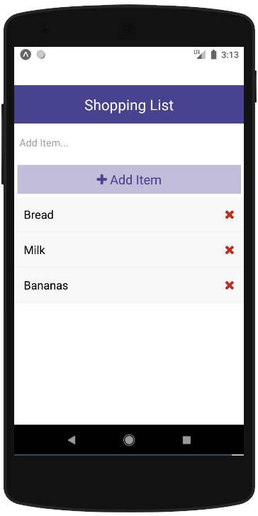

<!-- PROJECT LOGO -->
<br />
<p align="center">
  <a href="https://github.com/jeiku/react-native-shopping-list">
    
  </a>

  <h3 align="center">React Native Shopping List</h3>

  <p align="center">
    Simple React Native Shopping List app
    <br />
    <br />
    <a href="https://snack.expo.io/@jakewest/simple-shopping-list"><strong>View Demo »</strong></a>
  </p>
</p>

<!-- TABLE OF CONTENTS -->
<details open="open">
  <summary>Table of Contents</summary>
  <ol>
    <li>
      <a href="#about-the-project">About The Project</a>
      <ul>
        <li><a href="#built-with">Built With</a></li>
      </ul>
    </li>
    <li>
      <a href="#getting-started">Getting Started</a>
      <ul>
        <li><a href="#prerequisites">Prerequisites</a></li>
        <li><a href="#installation">Installation</a></li>
      </ul>
    </li>
    <li><a href="#license">License</a></li>
  </ol>
</details>

<!-- ABOUT THE PROJECT -->

## About The Project


<br />

This is just a simple app built in React Native for practice. Feel free to check it out!

### Built With

- [React](https://reactjs.org/)
- [React Native](https://reactnative.dev/)

<!-- GETTING STARTED -->

## Getting Started

To get a local copy up and running follow these simple steps.

### Prerequisites

If you want to test in an actual Android or IOS virtual environment, you will need to refer to these docs to get the necessary installations beforehand.
[React Native Environment Setup](https://reactnative.dev/docs/environment-setup)

### Installation

1. Clone the repo
   ```sh
   git clone https://github.com/jeiku/react-native-shopping-list.git
   ```
2. Install NPM packages
   ```sh
   npm install
   ```
3. (If testing on Android emulator) Have emulator running. Start Metro terminal
   ```sh
   npx react-native start
   ```
   (If testing on IOS emulator) Start Metro terminal
   ```sh
   npx react-native start
   ```
4. (If Android) Connect to emulator
   ```sh
   npx react-native run-android
   ```
   (If IOS) Connect to emulator
   ```sh
   npx react-native run-ios
   ```

<!-- LICENSE -->

## License

Distributed under the MIT License. See `LICENSE` for more information.
